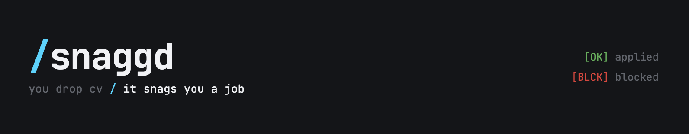

[](LICENSE)
[](https://python.org)
[](https://playwright.dev)
[](https://openrouter.ai)
[](#)

# snaggd

> Automated job application agent for [HH.ru](https://hh.ru) — the largest job board in Russia and CIS.

Reads your resume, scores each vacancy against it, writes a personalized cover letter, and submits the application — fully automated, one vacancy at a time.

**Why it exists:** HH.ru shut down its public API in December 2025. This agent uses Playwright to drive a real browser session instead.

**Tech stack:** Python 3.10+, Playwright, OpenRouter (BYOK — bring your own key)

---

## What it does

1. Logs into HH.ru using saved cookies (no stored password)
2. Scrapes vacancies from your search URLs
3. Scores each vacancy against your resume (0–100) — skips anything below your threshold
4. Generates a personalized cover letter via LLM, matching the vacancy's language and tone
5. Detects the form type (modal, questionnaire, chatik, etc.) and fills it accordingly
6. Logs every result to `data/applied_log.json`

All LLM calls go through [OpenRouter](https://openrouter.ai). Default model: `deepseek/deepseek-v3.2` (~$0.0002 per vacancy).

---

## Quickstart

### 1. Install

```bash
git clone https://github.com/d3faultnpc/snaggd.git
cd snaggd
python -m venv venv && source venv/bin/activate  # Windows: venv\Scripts\activate
pip install -r requirements.txt
playwright install chromium
```

### 2. Onboarding wizard (one time)

```bash
python onboarding/wizard.py
```

The wizard creates all required data files in order:

| Block | What it creates |
|-------|----------------|
| D — LLM config | `.env` with your OpenRouter key + model |
| A — Resume | `data/candidate.md` from your PDF/DOCX/image |
| B — Job prefs | `data/job_preferences.md` + `data/search_urls.txt` + `data/filters.json` (stop rules) |
| C — Tone | `data/tone_of_voice.md` (cover letter formality + optional style sample) |

Get a free OpenRouter key at [openrouter.ai](https://openrouter.ai).

### 3. Log in to HH.ru (one time)

```bash
python login.py
```

Opens a browser window — log in manually. Cookies are saved to `data/hh_cookies.json` and reused on every run.

### 4. Run

```bash
# Dry run first — scores vacancies, never clicks Apply
python main.py --dry-run

# Live run
python main.py

# Limit to N applications
python main.py --max 5
```

| Flag | Description |
|------|-------------|
| `--dry-run` | Score + log vacancies without submitting |
| `--max N` | Stop after N applications |
| `--debug` | Save page screenshots on unknown forms |

---

## Configuration

All config lives in `.env` (created by the wizard):

```bash
LLM_API_KEY=sk-or-...              # OpenRouter key (required)
LLM_MODEL=deepseek/deepseek-v3.2   # any OpenRouter model
COVER_MODEL=                       # optional: separate model for cover letters
MIN_SCORE=60                       # skip vacancies scoring below this
MAX_VACANCIES=10                   # max applications per run
MAX_SKIPS=10                       # stop session after N skipped vacancies
HEADLESS=false                     # true = no browser window
FILL_TESTS=false                   # true = attempt LLM fill for employer tests
DATA_DIR=./data                    # override data directory
PROXY_URL=                         # socks5://... (optional)
BROWSER_CORNER=false               # true = position browser in bottom-right corner
BROWSER_CORNER_X=1578              # corner X offset in pixels — tune for your screen
BROWSER_CORNER_Y=650               # corner Y offset in pixels — tune for your screen
```

---

## Architecture

```
main.py (orchestrator)
├── HHAdapter  (adapters/hh/adapter.py)
│   ├── HHBrowser    — Playwright: cookies, navigation, vacancy scraping
│   ├── FormDetector — DOM-based form classification (no LLM)
│   └── FormHandlers
│       ├── hh_modal     — city / metro / schedule dropdowns + cover textarea
│       ├── cover_only   — single cover textarea
│       ├── questions    — employer questionnaire (LLM batch fill)
│       ├── chat         — chatik redirect flow (auto-read employers)
│       ├── test_form    — employer test (skipped by default)
│       └── salary       — salary-only forms (skipped)
├── LLMCover  (llm_cover.py)   — cover letter + scoring, compound-key session cache
│   └── LLMAgent (core/llm_agent.py) — OpenRouter gateway
└── Logger    (logger.py)      — data/applied_log.json + daily logs
```

Two contexts, zero overlap:
- **Browser context** — all Playwright actions, zero LLM tokens
- **LLM context** — cover / score / form fill. System prompt (~1300 tokens, cached per session) = resume + preferences + tone. Per-vacancy cost ≈ 600 input tokens.

---

## Project structure

```
adapters/
  base.py               ← SiteAdapter ABC (extend for new job boards)
  hh/
    adapter.py          ← orchestration, stop filters, apply flow
    browser.py          ← Playwright: cookies, navigation, vacancy scraping
    detector.py         ← DOM-based form classification (no LLM)
    handlers/           ← one module per form type
      hh_modal.py       ← city / metro / schedule dropdowns + cover textarea
      cover_only.py     ← single cover textarea
      questions.py      ← employer questionnaire (LLM batch fill)
      chat.py           ← chatik redirect flow (auto-read employers)
      test_form.py      ← employer test (skipped unless FILL_TESTS=true)
      salary.py         ← salary-only forms (skipped)
core/
  llm_agent.py          ← OpenRouter gateway, session-scoped prompt cache
utils/
  filters.py            ← stop filter logic (title, company, rating, semantic)
  helpers.py            ← shared utilities
onboarding/
  wizard.py             ← CLI setup (blocks D→A→B→C)
  resume_parser.py      ← multimodal PDF/DOCX/image → structured resume data
  url_builder.py        ← job preferences → HH search URLs
prompts/
  cover_letter.md       ← cover generation: tone, hooks, forbidden openers
  match_scoring.md      ← vacancy scoring: signals, penalties, role-type match
  form_fill.md          ← form field answering: salary, employer questions
  cv_extractor.md       ← resume extraction prompt (used by resume_parser.py)
data/                   ← gitignored, created by wizard (your resume, cookies, logs)
scripts/                ← dev utilities (vacancy inspector, label tester)
```

---

## Limitations

- **HH.ru only** — multi-site support is planned for Phase 2
- **Russian job board** — cover letters are generated in the vacancy's language (Russian or English)
- **Cookie-based auth** — if cookies expire, re-run `login.py`
- **Tested on macOS** — should work on Linux; Windows untested

---

## Roadmap

**Phase 2 — Desktop app (planned)**
A native desktop app (Tauri + Python backend) wrapping the current CLI with a UI: profile manager, live session monitor, application history dashboard. No App Store dependency.

**Multi-site support**
The adapter framework (`adapters/base.py`) is already in place. LinkedIn and other CIS job boards are in scope for Phase 2.

**Resume enhancement**
ATS optimizer: takes your existing resume and suggests targeted edits to improve match rates against a specific job description.

---

## Contributing

See [CONTRIBUTING.md](CONTRIBUTING.md) for how to add a new site adapter.

---

## License

MIT — see [LICENSE](LICENSE).
